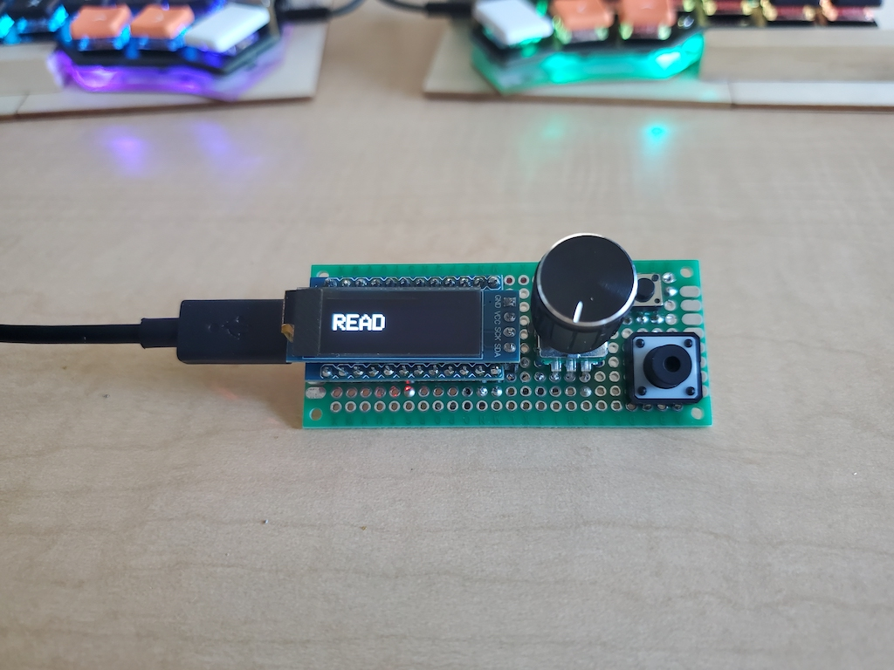
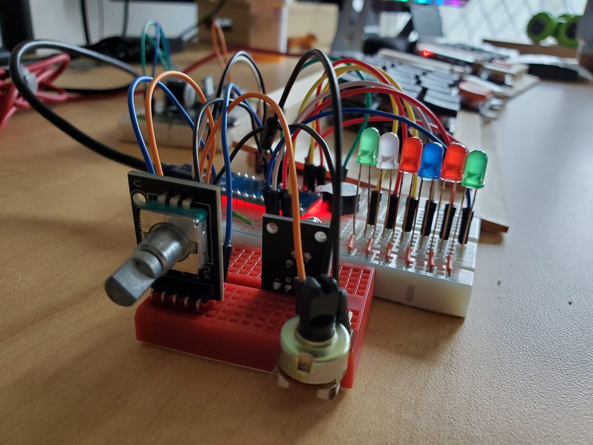

# One knob and two keys

This is hobby project of building an UID device so that it can have one knob and two keys to extend the keyboard. Here are the supported features.

## Design

## Features

#### Select

When the button is pressed, it lets you use the knob to select through a bunch of modes, such as code, media, screen, record and etc. When you are done, you can use the same button to dismiss the menu and return to the selected mode.

#### Mode

When under a mode, the knob can function accordingly. For instance, on the media mode, the knob turns the volume up and down. And while on the screen mode, the knob turns the page up and down.

Same behavior appleis to the other two keys. On the media mode, the first key can play/pause the video and the second key can mute/unmute the video. While on the record mode, the first key can start the recording and the second key can play/stop the recording.

#### Config

Currently the customization is through the firmware.
